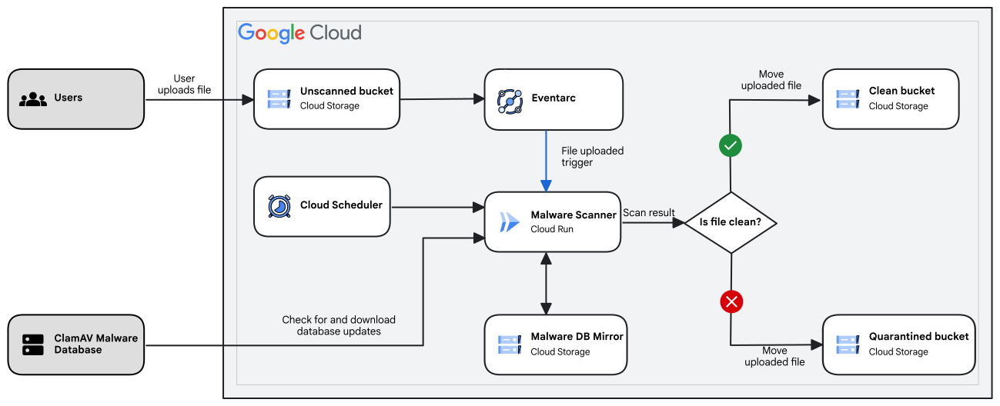

> https://cloud.google.com/architecture/automate-malware-scanning-for-documents-uploaded-to-cloud-storage?hl=zh-cn

# 对上传到 Cloud Storage 的文件进行自动恶意软件扫描

Last reviewed 2023-05-17 UTC

此参考架构向您展示了如何构建事件驱动的流水线，以帮助您自动评估文件是否存在恶意软件，例如特洛伊木马、病毒和其他恶意代码。对上传到 [Cloud Storage](https://cloud.google.com/storage?hl=zh-cn) 的大量文件进行手动评估，对于大多数应用来说都非常耗时。自动化此过程可以帮助您节省时间并提高效率。

此架构中的流水线使用 Google Cloud 产品以及开源防病毒引擎 [ClamAV](https://www.clamav.net/)。您还可以使用在 Linux 容器中按需扫描的任何其他反恶意软件引擎。在此架构中，ClamAV 在托管在 [Cloud Run](https://cloud.google.com/run?hl=zh-cn) 中的 Docker 容器中运行。流水线还将日志条目写入 [Cloud Logging](https://cloud.google.com/logging?hl=zh-cn) 并将指标记录到 [Cloud Monitoring](https://cloud.google.com/monitoring?hl=zh-cn)。

## 架构

下图概述了架构：

该架构展示了以下流水线：

- 用户上传的文件扫描流水线，可检查上传的文件是否包含恶意软件。
- ClamAV 恶意软件数据库镜像更新流水线，用于维护 ClamAV 使用的恶意软件数据库的最新镜像。

以下各部分详细介绍了流水线。

### 用户上传的文件扫描流水线

文件扫描流水线的工作方式如下：

1. 最终用户将其文件上传到未经扫描的 Cloud Storage 存储桶。
2. Eventarc 服务会捕获此上传事件，并告知 Cloud Run 服务系统已上传此新文件。
3. Cloud Run 服务会从未经扫描的 Cloud Storage 存储桶下载该新文件，并将其传递给 ClamAV 恶意软件扫描工具。
4. 根据恶意软件扫描的结果，该服务会执行以下操作之一：
   - 如果 ClamAV 声明该文件干净，则系统会将其从未经扫描的 Cloud Storage 存储桶移到干净的 Cloud Storage 存储桶。
   - 如果 ClamAV 声明该文件包含恶意软件，则系统会将该文件从未经扫描的 Cloud Storage 存储桶移到隔离的 Cloud Storage 存储桶。
5. 该服务会将这些操作的结果报告给 Logging 和 Monitoring，以便管理员可以相应地采取措施。

### ClamAV 恶意软件数据库镜像更新流水线

ClamAV 恶意软件数据库镜像更新流水线会保留 Cloud Storage 中数据库的最新[专用本地镜像](https://docs.clamav.net/appendix/CvdPrivateMirror.html)。这可确保系统只在每次更新 ClamAV 公共数据库时访问该数据库一次以下载较小的增量更新文件，而不是下载完整数据库，从而防止发生速率限制。

此流水线的工作方式如下：

1. 将一个 Cloud Scheduler 作业配置为每两个小时触发一次，这与 ClamAV freshclam 服务所使用的默认更新检查间隔相同。此作业会向 Cloud Run 服务发出 HTTP `POST` 请求，以指示其更新恶意软件数据库镜像。
2. Cloud Run 实例会将恶意软件数据库镜像从 Cloud Storage 存储桶复制到本地文件系统。
3. 然后，该实例会运行 [ClamAV CVDUpdate](https://github.com/Cisco-Talos/cvdupdate) 工具，以下载所有可用的增量更新并将其应用于数据库镜像。
4. 之后，它会将更新后的恶意软件数据库镜像复制回 Cloud Storage 存储桶。

启动时，在 Cloud Run 实例中运行的 [ClamAVFreshclam](https://docs.clamav.net/manual/Usage/SignatureManagement.html#freshclam) 服务会从 Cloud Storage 下载恶意软件数据库。在运行时，该服务还会定期检查 Cloud Storage 存储桶中任何可用的数据库更新并下载更新。

## 设计考虑事项

以下指南可帮助您开发满足组织可靠性、费用和运营效率要求的架构。

### 可靠性

为了能够有效扫描，ClamAV 恶意软件扫描工具需要维护最新的恶意软件签名数据库。系统会使用 Cloud Run（这是一项无状态服务）来运行 ClamAV 服务。在服务实例启动时，ClamAV 必须始终下载最新的完整恶意软件数据库，其大小为数百 MB。

ClamAV 的公共恶意软件数据库托管在内容分发网络 (CDN) 上，因此系统可能会对这些下载施加速率限制。如果多个实例启动并尝试下载完整数据库，则可能会触发速率限制。这会导致 Cloud Run 使用的外部 IP 地址被屏蔽 24 小时；从而导致 ClamAV 服务无法启动，也无法下载恶意软件数据库更新。

此外，Cloud Run 是使用外部 IP 地址的共享池。因此，CDN 会将来自不同项目的恶意软件扫描实例的下载操作视为来自单个地址，从而也会触发屏蔽。

### 费用优化

此架构使用 Google Cloud 的以下收费组件：

- [Cloud Storage](https://cloud.google.com/storage/pricing?hl=zh-cn)
- [Cloud Run](https://cloud.google.com/run/pricing?hl=zh-cn)
- [Eventarc](https://cloud.google.com/eventarc/pricing?hl=zh-cn)

如需根据您的预计使用量来估算费用，请使用[价格计算器](https://cloud.google.com/products/calculator?hl=zh-cn)。

### 运营效率

如需针对受感染的文件[触发基于日志的提醒](https://cloud.google.com/monitoring/alerts?hl=zh-cn)，您可以使用 Logging 中的日志条目。但是，设置这些提醒超出了此架构的范围。

## 部署

如需部署此架构，请参阅[为上传到 Cloud Storage 的文件部署自动恶意软件扫描](https://cloud.google.com/architecture/automate-malware-scanning-for-documents-uploaded-to-cloud-storage/deployment?hl=zh-cn)。

## 后续步骤

- 探索 [Cloud Storage 文档](https://cloud.google.com/storage/docs?hl=zh-cn)。
- 如需查看更多参考架构、图表和最佳实践，请浏览[云架构中心](https://cloud.google.com/architecture?hl=zh-cn)。